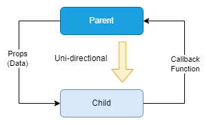
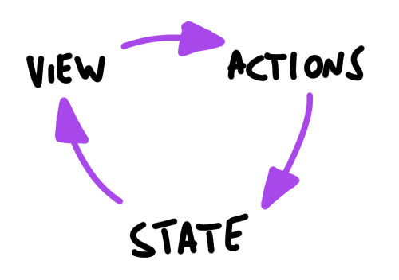
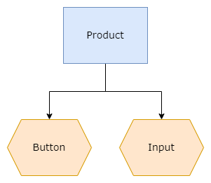
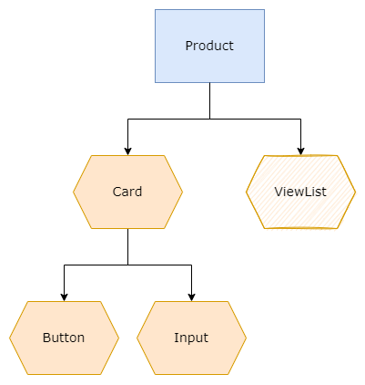

# 2.5 Uni-directional Data Flow

## Preparation

Fork and clone the [lesson repo](https://github.com/su-ntu-ctp/6m-software-2.8-uni-data-flow.git) from GitHub. Change to the `app` folder copy the `begin` sub-folder into a working folder, e.g. `work`. Change into your work folder and start the React app.

```
cd work
npm install
npm start
```
The starting code is basically the same code we saw earlier, with `Counter` now renamed as `Product`, and additional input field and `Add Product` button at the bottom of the page.

## Lesson Overview

For this session, we will continue where we left off with passing functions as props and diving deeper into how React components pass data in one direction, i.e. *uni-directional data flow* or one-way data binding.

### Uni-directional Data Flow

In React, data flows in a single-direction, from a parent to a child component. Parent components will manage states which can only affect its children components. Child components may receive the state values as read-only props and are not able to change the state of its parent or siblings, i.e. props are immutable.

If a child component has actions that would change the state of its parent in any way, e.g. an input component that receives user keystrokes, it must relay the result back to the parent. The state change is triggered via a callback function that is sent from the parent as a prop. Such a callback function is usually a handler that would call the `useState` update function to change the state, i.e. *inverse data flow*.



Once the parent's state is updated, it will propagate to the rest of the children under its component tree. The children components will then update its own internal views according to the new state update.

This completes the Action-State-View cycle in the component tree, until the next action is triggered.



> Source: https://flaviocopes.com/react-unidirectional-data-flow/

A good practice when designing React components is to generalise them into two categories of components:

- Presentational
- Container

### Presentational Components

Presentational components are only concerned with rendering the view according to a styling and data passed to them. They rely on props for their data, but do not have direct access to data stores. They are sometimes known as *dumb components*.

- Concerned about how data looks
- Have their own styles
- Do not change props (immutable)
- Rarely have their own state

### Container Components

Containers contain the business logic of the application. They can make API calls, do processing, compute values, etc. They usually depend on presentational components to show their data. Also known as *smart components*.

- Concerned about how things work
- Uses states to serve data sources
- Provides data to presentational components

## Part 1: Refactor the Parent Component

Refactor `Product.js` by splitting up the component into smaller logical container and presentational components. The starter `Product` component relationship looks like the following:



`Product` is a container component which:
- Stores and manages all state variables
- Handles update functions
- Calculates all business logic (in next part)

Refactor `Product` and move the presentational parts into a new `Card` component which:
- Receives data and handler functions from `Product` as props
- Displays data output
- Accepts user input using `Input`
- Provision a new `ViewList` component to display product data



## Part 2: Generate the Product Item List

The `Product` component shall store the the list as an array with two elements: product name and price:

```js
// Product.js

const [list, setList] = const useState([]);

```

The list is initially empty and will be filled up with new items when the user clicks on the 'Add Product' button. Since the button is a child of the `Card` component, `Product` has to pass a handler function to `Card` in order to update the product list. 

Complete the `handlerAddProduct` call function in `Product` that will be passed to child `Card` component. Start by creating a new product item (object) to be added to the list and assigning the `name` and `price` state variables as its fields:
```js
// Product.js

const handlerAddProduct = () => {
  const newItem ={
    name: name,
    price: price
  }
}

```

After creating the new item object, copy the current `list` (state variable) with ES6 spread operator `{...}` and new item at the end of the list. Finally, update `list` with `setList`. 

```js
const handlerAddProduct = () => {
  ...
  const newList = [...list, newItem];
  setList(newList)

```

> Since `list` is an immutable object, you cannot simply `push` a new item onto the the existing state `list`. You must make a copy of the original list with the added new item before updating the whole `list` using the update function `setList`.

## Part 3: Create ViewList Component

The `ViewList` component shall receive a list of items from `Product` and display at as a table at the bottom of the page. The data items in each row contains the product name and price, with provision to easily add additional columns later.   

The product list array is stored as a state variable, `list` that cam be sent to the `ViewList` child component as a prop. Since `ViewList` is a *presentational component*, its single job is simply display the content of the `list` array.

Start by creating a new `ViewList.js` file and its corresponding `ViewList.module.css` style sheet in the `components` folder. You may copy the CSS from this [file](./app/final/src/components/ViewList.module.css).


```js
// ViewList.js

import styles from './ViewList.module.css';

function ViewList({ list }) {
  return (
    <div>
      <table className={styles.table}>
        <thead>
          <tr>
            <th>Product</th>
            <th>Price</th>
          </tr>
        </thead>
        <tbody> 
          ...// Add code here...
        </tbody>      
      </table>
    </div>
  )
}
export default ViewList
```

Create a JSX list of table elements using the ES6 `Array.map()` method as follows:
```js
  ...
  <tbody>
    {list.map((item, i) => (
      <tr key={i}>
        <td>{item.name}</td>
        <td>{item.price}</td>
      </tr>
    ))}
  </tbody>
  ...
```

The `map` method goes through each item in the list array and assigns a `<tr>` table row element, which contains two data cells, name and price. The `key` attribute in each row is required by React to keep track of changes in the `list` elements in the Virtual DOM. 

> In real-world applications, the React community recommmends using truly unique IDs as list keys, instead of using index keys (i). However, we are keeping things simple for the purpose of this exercise and will re-visit this topic in more detail in later chapters. 

Refer to [app/final folder](./app/final/) for the completed app with basic functionality.

